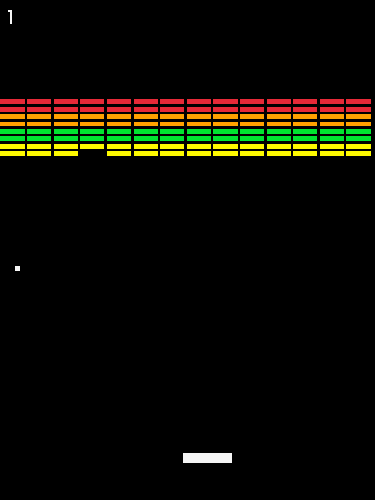

# Breakout Game

A classic Breakout game implementation in Go using Raylib, featuring clean architecture and modern Go practices.

## Demo


## Screenshots



## Features

- **Classic Breakout Gameplay** - Destroy all bricks to advance levels
- **Colorful Brick System** - Different colored bricks with varying point values
- **Dynamic Difficulty** - Ball speed increases as you progress
- **Sound Effects** - Audio feedback for paddle and brick collisions
- **Responsive Controls** - Smooth paddle movement with variable speed
- **Scoring System** - Points based on brick colors and positions
- **Multiple Levels** - Progress through challenging levels

## Controls

| Key | Action |
|-----|--------|
| `A` / `D` | Move paddle left/right |
| `W` / `S` | Increase/decrease paddle speed |
| `Space` | Start game / Resume from pause |
| `R` | Restart game (when game over) |

## Quick Start

### Prerequisites

- Go 1.21 or higher
- Raylib dependencies (automatically handled by raylib-go)

### Installation & Running

```bash
# Clone the repository
git clone <your-repo-url>
cd breakout

# Run the game
go run main.go

# Or build and run
make build
./breakout
```

### Development Commands

```bash
make build    # Build the executable
make run      # Build and run the game
make test     # Run all tests
make clean    # Clean build artifacts
make check    # Run formatting, vetting, and tests
```

## Architecture

This project showcases professional Go development practices with a clean, modular architecture:

```
internal/
├── game/          # Main game logic and state management
├── entities/      # Game entities (Ball, Paddle, Brick, etc.)
├── physics/       # Collision detection engine
├── audio/         # Sound management
├── renderer/      # Rendering utilities
├── types/         # Common types and interfaces
└── config/        # Configuration management
```

### Design Principles

- **Separation of Concerns** - Each package has a single responsibility
- **No Global State** - All state is properly encapsulated and dependency-injected
- **Interface-Based Design** - Flexible interfaces for collision detection and rendering
- **Proper Error Handling** - Comprehensive error handling for resource loading
- **Resource Management** - Clean resource cleanup with defer patterns
- **Testable Code** - Unit tests demonstrate component isolation

## Game Mechanics

### Brick System
- **Red Bricks** (Top rows): 7 points, trigger speed increase on first hit
- **Orange Bricks**: 5 points, trigger speed increase on first hit  
- **Green Bricks**: 3 points
- **Yellow Bricks** (Bottom rows): 1 point

### Speed Increases
- First red/orange brick hit
- After 4 total brick hits
- After 12 total brick hits
- Ball hits upper wall (also halves paddle width)

### Winning & Losing
- **Win**: Clear all bricks in all levels
- **Lose**: Ball falls below paddle

## Testing

The modular architecture enables comprehensive unit testing:

```bash
# Run all tests
go test ./...

# Run tests with coverage
go test -cover ./...

# Run specific package tests
go test ./internal/entities/
```

Example test output:
```
TestBrickGetValue - Verifies point values by row
TestBrickColorChecks - Tests color identification methods
TestCreateLevelBricks - Validates level generation
```

## Dependencies

- **[raylib-go](https://github.com/gen2brain/raylib-go)** - Go bindings for Raylib graphics library
- **Go 1.21+** - Modern Go features and performance

## Future Enhancements

The clean architecture makes it easy to add:

- **Power-ups** - Speed boost, multi-ball, larger paddle
- **High Scores** - Persistent leaderboard system
- **Settings Menu** - Configurable difficulty and controls
- **Background Music** - Enhanced audio experience
- **Visual Effects** - Particle systems and animations
- **Game Modes** - Time attack, survival mode
- **Level Editor** - Custom level creation
- **Multiplayer** - Local or network multiplayer support

## Contributing

1. Fork the repository
2. Create a feature branch (`git checkout -b feature/amazing-feature`)
3. Commit your changes (`git commit -m 'Add amazing feature'`)
4. Push to the branch (`git push origin feature/amazing-feature`)
5. Open a Pull Request

## License

This project is licensed under the MIT License - see the [LICENSE](LICENSE) file for details.

## Acknowledgments

- Original Breakout game by Atari (1976)
- [Raylib](https://www.raylib.com/) for the excellent graphics library
- Go community for amazing tooling and practices

---

*Built with ❤️ and Go*
